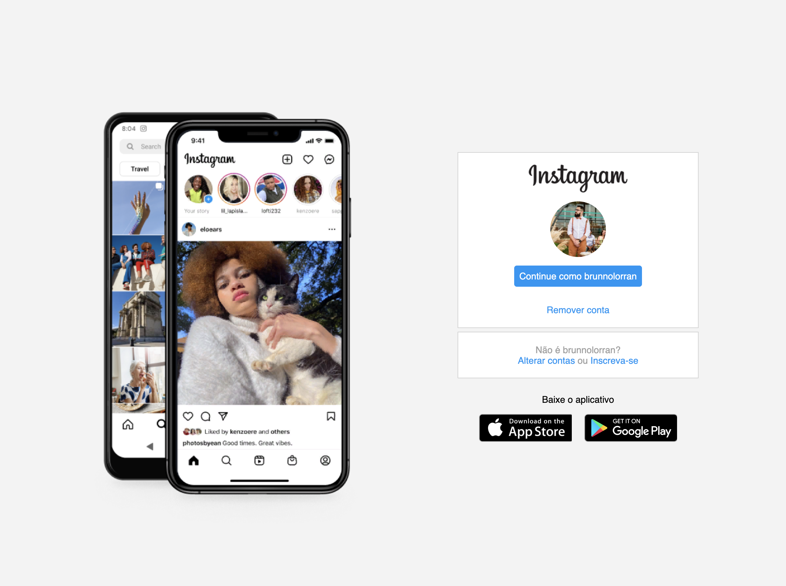

# Oi, tudo bem? Aqui foi um desafio de flex-box da Digital Innovation One 🙃

Esse é o repositório do desafio de Flexbox, na qual foi feito a interface de login do Instagram!
Além da interface atual do instagram que foi proposta no desafio eu fiz um redesign também.

### Telas

### Os requisitos exigidos foram o uso de:

- [HTML básico](https://www.w3schools.com/html/)
- [CSS básico](https://developer.mozilla.org/pt-BR/docs/Web/CSS)

## 🚀 Let's code! 🚀
